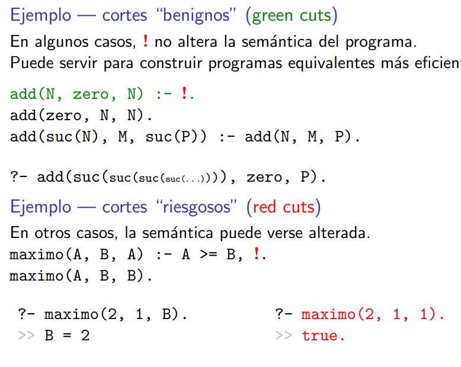
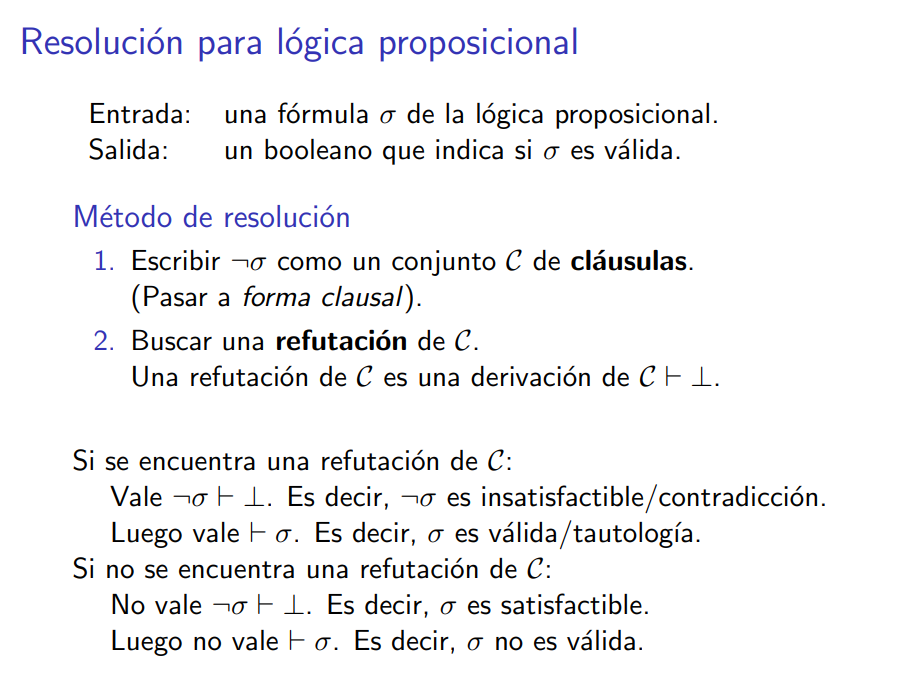
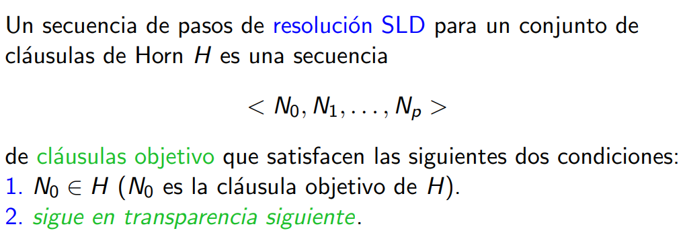

# Apunte final - Paradigmas UBA, FCEyN.
> Sebastián Andrés - 02/2025

1. Programación funcional en Haskell y esquemas de recursión.
2. Razonamiento ecuacional e inducción estructural.
3. Deducción natural para lógica proposicional y de primer orden.
4. Cálculo-λ, sistemas de tipos y semántica operacional.
5. Unificación e inferencia de tipos.
6. Programación lógica en Prolog.
7. Métodos de resolución general y SLD.
8. (Rudimentos de) programación orientada a objetos en SmallTalk.

## 1. Programación funcional en Haskell y esquemas de recursión.

### Esquemas de recursion
~~~hs
--Estructural
foldr :: (a -> b -> b) -> b -> [a] -> b
foldr f z [] = z
foldr f z (x:xs) = f x (foldr f z xs)

--Iterativa
foldl :: (b -> a -> b) -> b -> [a] -> b
foldl f ac [] = ac
foldl f ac (x:xs) = foldl f (f ac x) xs

--Primitiva
recr :: (a -> [a] -> b -> b) -> b -> [a] -> b
recr f z [] = z
recr f z (x:xs) = f x xs (recr f z xs)

-- En la otra notación es esta ídea.. 
foldr' cEmpty cC l = case l of
    [] -> cEmpty
    x xs -> cC x (rec xs)
    where rec = foldr' cEmpty cC

recr' z f l = case l of 
    [] -> z
    x xs -> f x xs (rec xs)
    where rec = recr' z f l
~~~

### Funciones útiles de Haskell
~~~hs
null :: [a] -> Bool                                  -- True si la lista es vacía
head :: [a] -> a                                     -- Devuelve el primer elemento de la lista
tail :: [a] -> [a]                                   -- Devuelve la lista sin el primer elemento
length :: [a] -> Int                                 -- Devuelve la longitud de la lista
init :: [a] -> [a]                                   -- Devuelve la lista sin el último elemento
last :: [a] -> a                                     -- Devuelve el último elemento de la lista
take :: Int -> [a] -> [a]                            -- Devuelve los primeros n elementos de la lista
drop :: Int -> [a] -> [a]                            -- Devuelve la lista sin los primeros n elementos
(++) :: [a] -> [a] -> [a]                            -- Concatena dos listas
concat :: [[a]] -> [a]                               -- Concatena una lista de listas
(!!) :: [a] -> Int -> a                              -- Devuelve el n-ésimo elemento de la lista
elem :: Eq a => a -> [a] -> Bool                     -- True si el elemento pertenece a la lista
zip :: [a] -> [b] -> [(a, b)]                        -- Combina dos listas en una lista de pares
zipWith :: (a -> b -> c) -> [a] -> [b] -> [c]        -- Combina dos listas con una función
repeat :: a -> [a]                                   -- Repite un elemento infinitamente
iterate :: (a -> a) -> a -> [a]                      -- Aplica una función infinitamente
takeWhile :: (a -> Bool) -> [a] -> [a]               -- Devuelve los elementos que cumplen la condición
dropWhile :: (a -> Bool) -> [a] -> [a]               -- Devuelve la lista sin los elementos que cumplen la condición
filter :: (a -> Bool) -> [a] -> [a]                  -- Devuelve los elementos que cumplen la condición
map :: (a -> b) -> [a] -> [b]                        -- Aplica una función a todos los elementos de la lista
~~~

## 2. Razonamiento ecuacional e inducción estructural.

### Demostración de igualdades con inducción
Podemos utilizar:
> Principio de reemplazo.
> Principio de extensionalidad sobre la estructura.

### Demostración de isomorfismo
Para mostrar isomorfismo entre $A$ y $B$ ($A \simeq B$). 
Armar dos funciones de la forma:
$f : A \rightarrow B$
$g : B \rightarrow A$
Y ver que sean inversas
$f.g = id : B \rightarrow B$ 
$g.f = id : A \rightarrow A$

## 3. Deducción natural para lógica proposicional y de primer orden.

## Modelos $(M, I)$ 

## 4. Cálculo-λ, sistemas de tipos y semántica operacional.

> Valores
> Los valores son los resultados esperados de los programas. Se definen como los términos
cerrados V producidos por la gramática de valores.

### Sistemas polimórficos de tipos
El texto menciona dos sistemas polimórficos: el Sistema F y el polimorfismo let.

#### Sistema F
Los tipos en el Sistema F son los mismos que los de tipos simples, pero se agregan variables y un cuantificador universal para ligar esas variables. El Sistema F no es dirigido por sintaxis, lo que significa que, dado un término, no siempre es trivial saber qué regla de tipado aplicar. De hecho, no existe un algoritmo de inferencia que pueda hacerlo, es indecidible.

#### Polimorfismo LET
Este sistema es menos general que el Sistema F, pero es dirigido por sintaxis y decidible. En el polimorfismo let, solo se permite el cuantificador universal (∀) en la variable ligada por el let. Se distinguen los tipos sin cuantificadores (llamados "tipos") de los tipos cuantificados (llamados "esquemas de tipos"). Este sistema permite un buen compromiso entre la reusabilidad de código y la inferencia de tipos. El sistema de tipos de Hindley-Milner es un sistema de tipos para el polimorfismo let en el que cada término tiene una sola regla para derivar su tipo, lo que lo hace dirigido por sintaxis.

## 5. Unificación e inferencia de tipos.

El resto esta en las hojas del machete inferencia de tipos:

## 6. Programación lógica en Prolog.

Un programa en Prolog es un conjunto de cláusulas de definición.
Una consulta en Prolog es una cláusula objetivo.

Prolog busca sucesivamente todas las refutaciones haciendo DFS.

<b>Criterio de busqueda:</b> las reglas se usan en orden de aparicion.

Al evaluar un goal, los resultados posibles son los siguientes:
> 1. True: la resolucion termino en la clausula vacıa.
> 2. False: la resolucion termino en una clausula que no unifica con ninguna regla del programa.
> 3. El proceso de aplicacion de la regla de resolucion no termina

### Árboles de búsqueda

~~~pl
% Ejemplo

S(X,Y)
|-> p(X), not(r(X,Y))
|    |-> not(r(a,Y)) .............................. {X = a}
|    |    |-> r(a,Y), !, Fail
|    |    |    |-> q(a), !, p(Y), !, Fail
|    |    |        |-> !, p(Y), !, Fail
|    |    |           |-> p(Y), !, Fail
|    |    |           |   |-> !, Fail, {Y = a}
|    |    |           |        |-> !, Fail
|    |    |           |            |-> Fail.
|    |    |           |               |-> X
|    |    |           |-> cut
|    |    |-> cut
|    |-> not(r(b,Y)) ----------------------- {X = b}
|        |-> r(b, Y), !, Fail
|            |-> q(b), !, p(Y)
|                |-> X
|-> q(c), r(c, Y).
    |-> r(c, Y)
        |-> q(c), !, p(Y)
            |-> !, p(Y)
                |-> p(Y)
                    |-> V --------------- {Y = a}
                    |-> V --------------- {Y = b}
~~~

### Esquema Generate & Test (G&T)
Una técnica que usaremos muy a menudo es:
- 1. Generar todas las posibles soluciones de un problema (los candidatos a solucion, segun cierto criterio general)
- 2. Testear cada una de las soluciones generadas (hacer que fallen los candidatos que no cumplan cierto criterio particular)

La idea se basa fuertemente en el orden en que se procesan las reglas.
~~~pl
pred(X1,...,Xn) :- generate(X1, ...,Xm), test(X1, ...,Xm).
% generate(...) debera instanciar ciertas variables.
% test(...) debera verificar si los valores intanciados pertenecen a la solucion, 
%           pudiendo para ello asumir que ya esta instanciada.

% Por ejemplo:
listasGemelas([], []).
listasGemelas(A, B) :- 
    desde(0, N), % genero la longitud de las listas capicuas
    generarListaTam(N, A), % genero una lista de tamaño N
    generarListaTam(N, B), % genero otra lista de tamaño N
    sonEspejo(A, B).       % testeo la condicion
~~~

### Reversibilidad
Un predicado define una relacion entre elementos. No hay parametros de “entrada” ni de “salida”.

Conceptualmente, cualquier argumento podrıa cumplir ambos roles dependiendo de como se consulte.

Un predicado podrıa estar implementado asumiendo que ciertas variables ya estan instanciadas, por diversas cuestiones practicas.

Cuando un argumento puede venir instanciado o instanciarse se lo nota $?X$.

### Aritmetica

### Metapredicados

#### not
not(p(X1, ..., Xn)) tiene exito si no existe instanciacion posible para las variables no instanciadas en ${X_1...X_n}$ que haga que $P$ tenga exito.
El not no deja instanciadas las variables libres luego de su ejecucion.
~~~pl
not(P) :- call(P), !, fail.
not(P).

% O tambien
not(P(X)) = P(X), !, Fail.
~~~

#### ! (cut)
El predicado ! tiene exito inmediatamente.

Al momento de hacer backtracking:
- Se vuelve atrás hasta el punto en el que se eligió usar la regla que hizo aparecer el operador de corte.
- Se descartan todas las elecciones alternativas.
- Se continúa buscando hacia atrás.

#### setof
~~~
% setof(-Var, +Goal, -Set)
% unifica Set con la lista sin repetidos de Var que satisfacen Goal.

% Un ejemplo:
% ?- setof((X,Y), (between(2,3,X), Y is X + 2), L).
% L = [(2, 4), (3, 5)].
~~~

### Predicados útiles
~~~pl
% var(A) tiene exito si A es una variable libre.
% nonvar(A) tiene exito si A no es una variable libre.
% ground(A) tiene exito si A no contiene variables libres.
% between(+A, +B, -C) 

% desde(+M, -N)
desde(0,0).
desde(0, N) :- M is N+1, desde(0, M).
~~~

## 7. Métodos de resolución general y SLD.

### Algoritmo de resolución
La idea del algoritmo es que para demostrar A válida vale mostrar que ~A es insatisfactible.
$$ \text{A valida} \iff \neg \text{A insatisfactible} $$

Para demostrar que $A$ se deduce de $H_1,..., H_n$, demostramos que $H_1, ..., H_n, \neg A$ es insatisfactible.
$$ \text{ QvQ: } (H_1 \land \dots \land H_n) \rightarrow A$$
$$ \neg ((H_1 \land \dots H_n) \rightarrow A) \equiv H_1 \land \dots \land H_n \land \neg A$$

#### Teoremas LPO

#### Reglas

#### ¿Qué representa la cláusula vacía?
En el cálculo de resolución, cada cláusula es una disyunción de literales. 
La resolución busca derivar nuevas cláusulas hasta que:
Se obtiene una cláusula vacía (∅), lo que significa que hemos encontrado una contradicción.
No hay más resolventes posibles, lo que indica que no podemos derivar una contradicción.
La cláusula vacía representa una disyunción sin literales, es decir, una proposición que siempre es falsa. Como hemos partido de una hipótesis asumida como verdadera, obtener algo falso implica que la hipótesis inicial no podía ser cierta, lo que demuestra su inconsistencia.

### Sobre las clausulas

#### Forma Normal Conjuntiva
El método trabaja con fórmulas en FNC (Forma Normal Conjuntiva).
Esto es una conjunción de clausulas que son disyunción de literales (fórmulas atómicas o su negacion).
Por ejemplo:
- $\{ \neg menor(X,Y), menor(c,Y) \}$ representa la clausula $\forall X. \forall Y. (\neg menor(X,Y) \lor menor(c, Y))$
- $\{ \{ \neg menor(X,Y), menor(c,Y) \}, \{ impar(Z), mayor(Z,w) \} \}$ son dos clausulas que representan a $\forall X. \forall Y. (\neg menor(X,Y) \lor menor(c,Y)) \land \forall Z. (impar(Z) \lor mayor(Z,w))$

#### Clausulas Horn

#### Pasajes a forma clausal

##### Lógica proposicional 

##### Lógica de primer orden

1. Reemplazar los $(a \to b)$ con $(\neg a \lor b)$.

2. Empujar el $\neg$ hacia adentro (tras esto obtenemos la forma normal negada).
    - $\neg (\forall X. \sigma) \equiv \exists X. \neg \sigma$
    - $\neg (\exists X. \sigma) \equiv \forall X. \neg \sigma$

4. Extraer los cuantificadores ($\forall, \exists$) hacia afuera asumiendo $X\notin fv(\tau)$ (tras esto obtenemos la forma normal prenexa).
    - i.e. $(∀X. σ) ∧ τ \equiv ∀X.(σ ∧ τ ) $

5. Skolemnizacion :: Deshacerse de los cuantificadores existenciales usando la tecnica de Herbrand-Skolem (Y en funcion de las variables ligadas antes por cuantificadores, si no hay, constante). Preserva la satisfactibilidad no la validez.

$$\forall X_1..X_n \exists Y P(X,Y) \equiv \forall X_1..X_n P(X,f(X_1...X_n))$$
$$\exists Y P(Y) \equiv P(c)$$

5. Pasaje a forma normal conjuntiva (la disjuncion de uniones). Por ejemplo: 
    - $\sigma \lor (\tau \land \rho) \leadsto (\sigma \lor \tau) \land (\sigma \lor \rho)$

6. Empujar los cuantificadores universales hacia el centro.

### Resolucion SLD

En el algoritmo visto de resolución, el espacio de búsqueda - inicialmente cuadrático - crece en cada paso.
• Resolución lineal reduce el espacio de búsqueda.
• Resolución SLD es lineal y (un poco) más eficiente, preservando completitud, pero solo se aplica con Clausulas Horn.

#### Correctitud
Para clausulas de Horn es correcto, esto es, si $D_1, . . . , D_n$ son cláusulas de definición y $G$ una cláusula objetivo:
Teorema: Si ${D_1, . . . , D_n, G}$ es insatisfactible, existe una refutación SLD.

